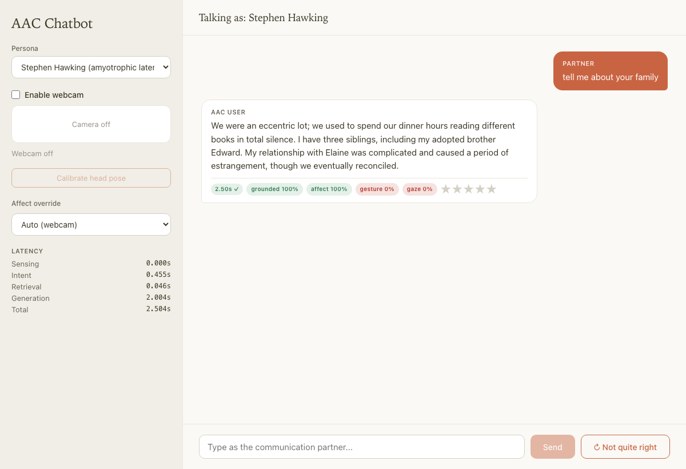
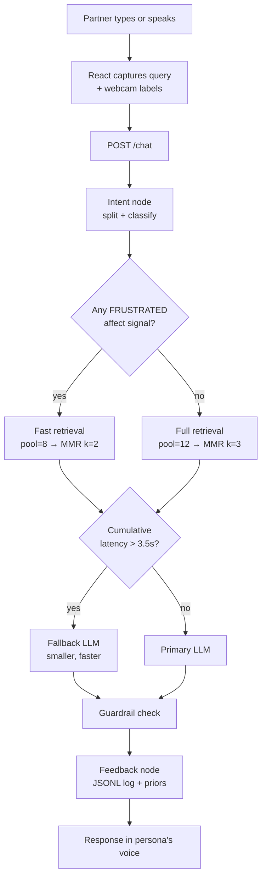
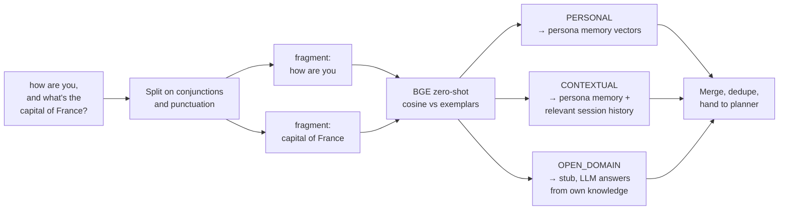
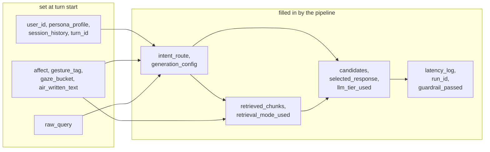

# Multimodal AAC Chatbot

A chatbot that **speaks as an AAC user, not to them.** You pick a persona — fourteen are shipped, anchored in real memoirs and canonical fiction — and the partner talks to them. The bot replies in that person's voice, using their memories, and adjusts what it says based on what the webcam sees: facial expression, hand gestures, where they're looking, and letters they trace in the air.

It's a training-free agentic RAG pipeline — a plain Python function chain with two branching points, torch matmul for retrieval, JSONL for logging. The goal was to keep every piece simple enough to read top-to-bottom in an afternoon.

---

## Table of Contents

- [What is AAC?](#what-is-aac)
- [System Architecture](#system-architecture)
- [Prerequisites](#prerequisites)
- [Setup](#setup)
- [Configuration](#configuration)
- [Running the Project](#running-the-project)
- [Hosting](#hosting)
- [Project Structure](#project-structure)
- [Personas](#personas)
- [Team](#team)

---

## What is AAC?

AAC (Augmentative and Alternative Communication) covers the tools people use when spoken or written communication is hard for them — cerebral palsy, ALS, autism, stroke recovery, and so on. Usually that's a tablet with a symbol grid, or an eye-tracker, or a switch. The slow part isn't the typing — it's that most devices don't know *you*. Every conversation starts from scratch.

This project is a small attempt at the other direction: give each user a persona their device already knows, and let the device reply in their voice.

---

## System Architecture

The browser does all the camera work. MediaPipe JS runs inside React, classifies what it sees into small labels (`affect`, `gesture_tag`, `gaze_bucket`, `air_written_text`), and sends those alongside the partner's text to `/chat`. The backend never touches pixels.

```
React (browser)                            Backend (Python)
  MediaPipe JS  ──┐
  Chat UI ────────┼── POST /chat ──► FastAPI ──► run_pipeline()
  Webcam ─────────┘                                │
                                       Intent ──► Retrieval ──► Planner ──► Feedback
```

Five layers, each a tiny file:

| Layer | Module | What it does |
|-------|--------|-------------|
| L1 | `frontend/src/hooks/useSensing.ts` | Watches the webcam. Turns faces/hands/gaze into string labels via MediaPipe blendshapes against a per-user calibrated baseline. Air-writing strokes are rendered to a PNG and recognised by a vision LLM via `/ink/recognize`. |
| L2 | `backend/pipeline/nodes/intent.py` | Splits the partner's question on conjunctions and punctuation, then classifies each fragment as PERSONAL, CONTEXTUAL, or OPEN_DOMAIN using cosine similarity against a handful of seed sentences. No LLM call. ~30ms per turn. |
| L3 | `backend/pipeline/nodes/retrieval.py` | Each sub-intent goes to its own pool. Personal → the user's memory vector store, softly reranked by session-level bucket + type priors (see below). Contextual → persona memory + relevant in-session turns layered on top (so "what did I just ask" still sounds like *them*). Open-domain → a stub chunk telling the LLM to answer from its own knowledge (web search is deliberately out of scope). Wide cosine pool → MMR rerank against a query-fused-with-recent-history vector → top 3. |
| L4 | `backend/pipeline/nodes/planner.py` | Builds the prompt, calls the LLM, picks a response. Tone and max_tokens are shaped by the detected affect. |
| L5 | `backend/pipeline/nodes/feedback.py` | Writes one JSONL row per turn and updates the session-level Bayesian priors over which memory buckets were useful. Skips the update when the guardrail blocked the turn. |

Two places the pipeline branches:
- **Frustrated affect** → use the fast retrieval path (smaller cosine pool of 8, MMR-rerank to k=2). The user wants an answer, not a thesis.
- **Cumulative latency past 3.5s** → switch to the smaller fallback model for generation.

### Session priors — two axes of topic tracking

The pipeline keeps **two** per-session Bayesian distributions that track what the current conversation is actually drawing from, and softly biases retrieval toward both:

- **P(bucket)** over the five memory buckets: `family`, `medical`, `hobbies`, `daily_routine`, `social`.
- **P(type)** over the three chunk types: `narrative`, `social_post`, `chat_log`. A casual "what's up today?" pulls more chat-log style; a factual question pulls more narrative.

Both axes share one axis-generic core in [backend/retrieval/priors.py](backend/retrieval/priors.py) — the `BUCKETS` and `CHUNK_TYPES` label vocabularies live there too. Same three pieces each:

- **Soft weighting, not hard filter.** In [vector_store.retrieve()](backend/retrieval/vector_store.py) each candidate's cosine score is adjusted by `0.3 · log P(bucket) + 0.2 · log P(type)`. Uniform priors add the same constant to every candidate — zero ranking effect at session start. As a topic (or style) accumulates evidence, its label gets a positive boost. Gaze fixation (an explicit user signal) still hard-filters the bucket axis.
- **Score-weighted evidence.** After each turn, the feedback node accumulates per-label mass across *all* retrieved personal chunks (cosine-shifted into `[0, ∞)`). A strong `medical` × `narrative` match moves both priors more than a weak `social` × `chat_log` one, and mixed turns update every contributing label proportionally.
- **Topic-drift decay.** Before each update the current distributions are pulled 15% toward uniform. Stale mass decays — if the conversation pivots from "medical" to "hobbies", the old medical prior relaxes within a handful of turns instead of dominating the rest of the session. Guardrail-blocked turns skip both updates entirely.

The per-turn JSONL log includes both `bucket_priors_after` and `type_priors_after`, so you can trace how either distribution evolved with a one-liner DuckDB query over `logs/turns.jsonl`.

### Per-turn eval pills in the UI

Every AAC-user bubble renders its eval scores inline. Up to seven pills, depending on what the turn produced:

- **SLO latency badge** — `t_total` against the configured target (default 6s). Green ✓ on pass, red ✗ on miss.
- **`grounded`** — sentence-level NLI faithfulness against retrieved memories. Renders `—` when there's no retrieved evidence to check (e.g. a `PRESENT_STATE` turn that skipped retrieval).
- **`relevant`** — BGE cosine similarity between query and response embeddings. Catches the "perfectly grounded but off-topic" failure mode that groundedness can't see.
- **`affect` / `gesture` / `gaze`** — multimodal alignment: sentiment match against the detected affect, opener-pattern match against the detected gesture, fraction of retrieved chunks from the gazed-at bucket.
- **`diversity`** — mean pairwise cosine distance across the candidate slate (only shown when ≥2 candidates). Low values flag the "aloha problem" — three paraphrases of the same answer.

Pills go green / grey / red on 0.75 / 0.4 thresholds. **Hover any pill** for a tooltip with the actual math from this turn (e.g. "2/2 sentences had NLI entailment prob ≥ 0.50", "3/3 retrieved chunks were from the family bucket"), powered by the `explain` block each scorer returns alongside its score. Authenticity stars sit on the right; clicking one fires `POST /feedback/rating` → `logs/ratings.jsonl`. All pill values come from `eval_scores` on the `/chat` response, computed in a `BackgroundTask` after the response returns and persisted to `logs/evals.jsonl`.



### End-to-end: from partner speaking to response rendered

One diagram, left to right, every step a turn goes through. Follow the arrows.

```mermaid
flowchart LR
    subgraph S1["① Partner side (browser)"]
        direction TB
        IN1[Partner types or speaks a question]
        IN2[Webcam frame]
        IN1 --> UI[Chat UI]
        IN2 --> MP[MediaPipe JS<br/>face + hands + gaze]
        MP --> LAB[Classify into labels<br/>affect, gesture_tag,<br/>gaze_bucket, air_written_text]
        UI --> REQ
        LAB --> REQ[POST /chat<br/>query + labels]
    end

    REQ ==> S2

    subgraph S2["② Backend pipeline (Python)"]
        direction TB
        HYD[Hydrate PipelineState<br/>session_history, priors, profile] --> INT
        INT[Intent node<br/>split query + classify fragments] --> BR1{FRUSTRATED?}
        BR1 -- yes --> RFAST[Fast retrieval<br/>pool=8 → MMR k=2]
        BR1 -- no --> RFULL[Full retrieval<br/>pool=12 → MMR k=3]
        RFAST --> POOL
        RFULL --> POOL[Dispatch per sub-intent]
        POOL --> PP[PERSONAL<br/>BGE vector store]
        POOL --> PC[CONTEXTUAL<br/>personal + BGE over history]
        POOL --> PO[OPEN_DOMAIN<br/>stub chunk]
        PP --> MERGE[Merge + dedupe]
        PC --> MERGE
        PO --> MERGE
        MERGE --> RR[MMR rerank<br/>query fused with<br/>last-N user turns]
        RR --> PLAN[Planner<br/>build prompt with<br/>retrieval blocks + tone tag]
        PLAN --> BR2{Total latency<br/>&gt; 3.5s?}
        BR2 -- yes --> LLMF[Fallback LLM<br/>Ollama Cloud, smaller]
        BR2 -- no --> LLMP[Primary LLM<br/>Ollama Cloud]
        LLMF --> GRD[Guardrail check<br/>persona breaks,<br/>unsupported claims]
        LLMP --> GRD
        GRD --> FB[Feedback node<br/>log turn to JSONL,<br/>bump bucket priors,<br/>append to session history]
    end

    FB ==> S3

    subgraph S3["③ Back to partner"]
        direction TB
        RESP[Response in persona's voice<br/>+ latency breakdown<br/>+ eval scores]
        RESP --> RENDER[Chat UI renders it]
    end
```



**A concrete example.** Partner says *"how are you, and what's the capital of France?"* while the webcam reads a relaxed face:

1. Browser sends `{query, affect: NEUTRAL, gesture_tag: null, …}`.
2. Intent node splits on `,` and ` and ` → two fragments. Classifier tags them `PERSONAL` and `OPEN_DOMAIN`.
3. Affect isn't FRUSTRATED, so full retrieval runs.
4. Dispatcher hits the persona store for fragment one, emits the open-domain stub for fragment two, merges both.
5. Planner drops the two chunks into separate prompt blocks and calls the primary LLM.
6. Guardrail passes, feedback writes the row, the response — in Mia's voice — comes back through the same `/chat` response.

Total wall time is normally under 6 seconds end-to-end; the slow part is the LLM call, not anything you wrote.

### What a single turn actually looks like



### How sub-intents fan out

This is the part that took a few iterations to get right. Each partner query can be *multiple* questions stitched together with "and" / "but" / punctuation. Each fragment gets classified separately and sent to its own retrieval pool.



The classifier is just cosine similarity against 5 seed sentences per class — no LLM, ~30ms per turn. The old version called an LLM and retried up to 3× on JSON errors; on a bad day that was 100+ seconds of dead time.

### State that flows between nodes

Every node takes a `PipelineState` dict and returns a partial update. Nothing is global.



---

## Prerequisites

- Python 3.10+ (we use conda; 3.12 is what the env ships with)
- Node.js 22+ and pnpm
- An [Ollama Cloud](https://ollama.com) account. Generation hits cloud models — you don't need a local Ollama daemon running.
- A webcam if you want to play with the full stack. The CLI works without one.

---

## Setup

```bash
git clone https://github.com/akashkolte/multimodal_aac_chatbot.git
cd multimodal_aac_chatbot
bash setup.sh
```

`setup.sh` takes care of everything on the first run: creates the `aac-chatbot` conda env, installs Python and frontend deps, copies `.env.example` → `.env` for you to fill in, and builds the per-persona vector indexes under `data/vector_store/`. The first build downloads the BGE-small embedder (~130MB), so expect a short wait.

If you edit a persona later, rebuild the indexes: `python -m backend.retrieval.vector_store`.

---

## Configuration

Everything is a Pydantic setting in [backend/config/settings.py](backend/config/settings.py) with a `.env` override. The knobs you'll actually touch:

| Variable | Default | What it does |
|----------|---------|-------------|
| `ACTIVE_LLM_TIER` | `primary` | Which tier to start on — `primary` or `fallback`. The pipeline switches automatically if a turn is slow. |
| `PRIMARY_MODEL` | `gemma4:31b-cloud` | Ollama Cloud model for the primary tier. |
| `FALLBACK_MODEL` | `gemma4:31b-cloud` | Smaller/faster model for the fallback tier. Point this at whatever smaller cloud model you have access to. |
| `PRIMARY_BASE_URL` | `http://localhost:11434/v1` | OpenAI-compatible endpoint. Defaults to the local Ollama proxy. |
| `FALLBACK_LATENCY_THRESHOLD` | `3.5` | If intent+retrieval already took this many seconds, skip the primary tier. |
| `RERANK_ENABLED` | `true` | Kill-switch for the MMR reranker. When off, retrieval truncates the cosine top-k directly. |
| `RERANK_LAMBDA` | `0.7` | MMR balance: `1.0` = pure cosine relevance, lower = more diversity. Drop to `0.5` if results look repetitive. |
| `RERANK_QUERY_WEIGHT` | `0.7` | Weight on the current turn vs the mean of recent user turns when building the rerank query. Lower if follow-ups under-weight prior context. |
| `LOGS_DIR` | `logs` | Where the per-turn JSONL goes. |
| `SLO_TARGET_S` | `6.0` | Latency SLO used by the efficiency eval. |
| `EVALS_ENABLED` | `true` | Toggle off to skip background eval scoring. |
| `NLI_MODEL` | `cross-encoder/nli-deberta-v3-small` | NLI model used for the groundedness/hallucination scorer. |
| `FAITHFULNESS_THRESHOLD` | `0.5` | Per-sentence entailment probability needed to count as grounded. |

---

## Running the Project

### Full stack

```bash
bash run.sh
```

Starts FastAPI on `:8000` and the React dev server on `:7550`. Open [http://localhost:7550](http://localhost:7550). This is the mode you want for the webcam + sensing demo.

Pass any `backend.main` flag to `run.sh` and it drops the full stack and runs the CLI with those flags instead — handy for fast iteration:

```bash
bash run.sh --debug                    # CLI with per-turn state dumps
bash run.sh --user mia_chen --debug    # jump straight to Mia
```

### CLI directly

```bash
conda activate aac-chatbot
python -m backend.main --debug
```

The CLI prints the full `PipelineState` after each turn — useful when you want to see what the classifier did or which chunks came back from which pool.

### API directly

```bash
conda activate aac-chatbot
uvicorn backend.api.main:app --reload
```

```bash
curl -X POST http://localhost:8000/chat \
  -H "Content-Type: application/json" \
  -d '{"user_id": "stephen_hawking", "query": "What do you like to do on weekends?"}'
```

### Offline eval aggregation

After a few turns have been logged, print a per-persona report:

```bash
conda activate aac-chatbot
python -m backend.evals.aggregate
```

Output covers latency quantiles + SLO pass rate, faithfulness (groundedness / hallucination), multimodal alignment, and the distribution of Likert ratings. Reads `logs/turns.jsonl`, `logs/evals.jsonl`, and `logs/ratings.jsonl`.

---

## Hosting

The project ships with a single [Dockerfile](Dockerfile) that builds the React frontend in stage 1 (Node 22 + pnpm) and runs the FastAPI backend in stage 2 (Python 3.12 + torch + sentence-transformers). The backend serves the built `frontend/dist/` as static files, so it's one container, one process, one port.

The same image runs identically in two places.

### Locally (for development that mirrors production)

```bash
docker build -t aac-chatbot .
docker run --rm -p 8000:8000 -e PORT=8000 --env-file .env aac-chatbot
# → http://localhost:8000
```

The `--env-file .env` injects your Ollama Cloud key + endpoints (same `.env` you use for `./run.sh`). Conda + `./run.sh` is still the fastest dev loop because it hot-reloads; the docker path is for when you want byte-identical-to-production behaviour.

### On Hugging Face Spaces (public URL for graders)

The repo doubles as an HF Space — `README.md` carries the YAML frontmatter HF needs (`sdk: docker`, `app_port: 7860`).

1. Create a new Space on huggingface.co (Docker SDK, public).
2. Add this repo as a remote:
   ```bash
   git remote add space https://huggingface.co/spaces/<your-username>/aac-chatbot
   git push space main
   ```
3. In the Space's *Settings → Variables and secrets*, add the LLM-tier secrets (don't commit them):
   - `PRIMARY_API_KEY`, `PRIMARY_BASE_URL`, `PRIMARY_MODEL`
   - `FALLBACK_API_KEY`, `FALLBACK_BASE_URL`, `FALLBACK_MODEL`
   - `INK_VISION_API_KEY`, `INK_VISION_BASE_URL`, `INK_VISION_MODEL`
4. The Space rebuilds the Dockerfile on every push. First build takes ~5-8 min (downloads BGE + builds vector indexes for all personas); subsequent builds reuse Docker layer cache and finish in 2-3 min.

The deployed instance won't persist `logs/` or `data/pick_index/` across container restarts (HF Spaces filesystem is read-only outside `/tmp`). For the writeup, your local logs are the source of truth — the Space is just a click-around demo for graders.

**Webcam note.** `getUserMedia` requires HTTPS, which both HF Spaces and `localhost` provide. Random IP addresses don't, so don't try to demo from a LAN IP without a tunnel.

---

## Project Structure

```
multimodal_aac_chatbot/
├── frontend/                      React + Vite + TypeScript
│   └── src/
│       ├── components/            Chat UI, webcam, sensing status
│       ├── hooks/                 useWebcam, useSensing (MediaPipe JS)
│       └── lib/                   API client, sensing classification, calibration, ink recognizer
│
├── backend/                       Python (conda env: aac-chatbot)
│   ├── main.py                    CLI entry point
│   ├── api/main.py                FastAPI REST API
│   ├── config/settings.py         Pydantic BaseSettings
│   ├── pipeline/
│   │   ├── graph.py               run_pipeline() — plain function chain
│   │   ├── state.py               PipelineState TypedDict
│   │   └── nodes/                 intent, retrieval, planner, feedback
│   ├── sensing/labels.py          GESTURE_DIRECTIVES (sensing runs in browser)
│   ├── retrieval/                 BGE embeddings (torch tensor) + bucket priors
│   ├── generation/llm_client.py   2-tier Ollama Cloud LLM client (primary/fallback)
│   ├── evals/                     faithfulness (NLI), efficiency, multimodal, aggregate CLI
│   └── guardrails/checks.py      Input + output safety checks
│
├── data/
│   ├── users.json                 Persona index
│   ├── memories/                  Per-persona memory JSONs
│   └── vector_store/              vectors.pt + meta.json (gitignored, rebuilt)
├── logs/                          Per-turn JSONL logs (gitignored)
│
├── setup.sh                       One-time setup script
├── run.sh                         Start backend + frontend
├── requirements.txt               Python dependencies
└── .env.example                   Environment variable template
```

---

## Personas

Fourteen personas — nine anchored in real memoirs, five in canonical fiction. Together they span ALS, Parkinson's, locked-in syndrome, aphasia, Alzheimer's, cerebral palsy, non-verbal and savant autism, intellectual disability, and spinal cord injury. The point isn't to represent any one person — it's to give the model a wide enough range of voices that "sound like Mia" is a harder target than "sound helpful."

| ID | Source | Condition |
|----|--------|-----------|
| `stephen_hawking` | Real — *My Brief History* + interviews | ALS (mid-stage) |
| `michael_j_fox` | Real — four memoirs | Young-onset Parkinson's |
| `wendy_mitchell` | Real — *Somebody I Used to Know* + blog | Early-onset Alzheimer's |
| `christopher_reeve` | Real — *Still Me* | C4 spinal cord injury |
| `christy_brown` | Real — *My Left Foot* | Cerebral palsy (adult) |
| `gabby_giffords` | Real — *Gabby* memoir | Aphasia + TBI |
| `jason_becker` | Real — *Not Dead Yet* doc | Late-stage ALS |
| `jean_dominique_bauby` | Real — *The Diving Bell and the Butterfly* | Locked-in syndrome |
| `tito_mukhopadhyay` | Real — three+ books | Non-verbal autism |
| `abed_nadir` | Fictional — *Community* | Autism (verbal) |
| `allie_calhoun` | Fictional — *The Notebook* | Late-stage Alzheimer's |
| `forrest_gump` | Fictional — *Forrest Gump* | Intellectual disability |
| `walter_jr_white` | Fictional — *Breaking Bad* | Cerebral palsy (teen) |
| `raymond_babbitt` | Fictional — *Rain Man* | Savant autism |

Each persona has ~120–210 memory chunks (canon-driven, no filler) across five buckets — `family`, `medical`, `hobbies`, `daily_routine`, `social` — and three chunk types: `narrative`, `social_post`, `chat_log`. Somewhere around 2,300 chunks total across the set.

Data provenance is documented. See [references.md](references.md) for the bibliography — memoirs, films, interviews — and the ethics notes on living-persons treatment.

Adding a new persona: drop a JSON file into `data/memories/` following the schema of any existing one, then run `python data/generate_users.py` and `python -m backend.retrieval.vector_store`.

---

## TODO

From the spec (pages 10–11). Tags: **[Core]** = must do, **[Bonus]** = nice to have, **[Eval]** = for the grade.

Heads up: all camera/sensing stuff is in the frontend (MediaPipe JS). Backend just gets the labels (`affect`, `gesture_tag`, `gaze_bucket`). Only `backend/sensing/labels.py` (`GESTURE_DIRECTIVES`) lives on the backend.

### Dataset

- [x] **[Core]** Memories carry three chunk types per persona — `narrative`, `social_post`, `chat_log` — each with a `bucket` label. Type is preserved through the vector-store metadata and feeds the P(type) session prior.

### Sensing (frontend)

- [x] **[Core]** Head-nod / sharp tilt / head-shake = "I don't like that". Different from frustrated affect.
  - [x] frontend `HeadPoseTracker` decomposes pitch/yaw/roll from MediaPipe's facial transformation matrix; emits `HEAD_SHAKE` (yaw oscillation), `HEAD_NOD` (gentle pitch dip + recovery), `HEAD_NOD_DISSATISFIED` (sharper pitch dip). All angles are measured as deviation from the per-user calibrated neutral pose (see Affect entry below for how calibration works), so a user with a naturally tilted head doesn't read as permanently nodding. Live p/y/r debug readout in the sidebar.
  - [x] dedicated `POST /chat/turnaround` endpoint reuses cached last-state — one extra LLM call, no full pipeline re-run
  - [x] intent-aware turnaround: PERSONAL re-retrieves excluding the rejected bucket *and* exact rejected chunk texts (with `turnaround_min_score` floor — falls back to original chunks rather than degrading); PRESENT_STATE flips emotional read or admits uncertainty
  - [x] UI: rejected bubble gets strikethrough + "rephrased" badge, new bubble appended with "↻ turnaround" badge — both visible (you can't unsay something to a partner). Manual "↻ Not quite right" button as fallback
  - [x] guards: `turnaroundConsumedTurnRef` prevents self-retrigger loops; backend `turn_id` returned in `ChatResponse` so frontend doesn't desync on persona switch; stale-turn 409
- [x] **[Core]** Smile / positive affect actually changes wording now. Affect compiles into a `StyleDirective` (register + prefer/avoid words + exemplar + opener hint) rendered as explicit instructions in the turn-specific user message — see `_AFFECT_CONFIG` in [backend/pipeline/nodes/intent.py](backend/pipeline/nodes/intent.py) and `_build_user` in [backend/pipeline/nodes/planner.py](backend/pipeline/nodes/planner.py). The persona's own `stylistic_preferences` (from the memory JSONs) carry the stable baseline in the cached system message; the affect directive is how that baseline shifts per turn. Measured by `compute_multimodal_alignment` (positive/negative lexicon).
  - Affect is read from MediaPipe FaceLandmarker blendshape scores (`mouthSmileLeft`, `browDownLeft`, `eyeSquintLeft`, `jawOpen`, `browInnerUp`, etc.) rather than hand-rolled landmark math. `classifyAffect` in [frontend/src/lib/sensing.ts](frontend/src/lib/sensing.ts) emits `HAPPY` / `FRUSTRATED` / `SURPRISED` / `NEUTRAL` from those scores.
  - **Per-user calibration window.** When the webcam first comes alive, a 5-second overlay records the user's neutral baseline — trimmed mean and stddev for each blendshape, plus neutral gaze direction and head pose. Detection then fires when a signal exceeds the user's *own* mean by `SIGMA_K = 2.0` standard deviations, so a face whose resting smile blendshape sits at 0.4 doesn't permanently read as HAPPY. One global tunable (σ multiplier) replaces the wall of magic-number thresholds the old geometric pipeline carried. `Calibrator` in [sensing.ts](frontend/src/lib/sensing.ts), wired through [useSensing.ts](frontend/src/hooks/useSensing.ts), surfaced in [CalibrationOverlay.tsx](frontend/src/components/CalibrationOverlay.tsx). A "Recalibrate" button on the sensing panel re-runs the window any time. Set `VITE_CALIBRATION_ENABLED=false` in `.env` to fall back to fixed thresholds for debugging.
- [x] **[Core]** Gestures come from MediaPipe's pretrained `GestureRecognizer` rather than hand-rolled landmark geometry. Mapped labels: `THUMBS_UP` / `THUMBS_DOWN` / `POINTING_UP` / `CLOSED_FIST` / `OPEN_PALM` / `VICTORY` / `I_LOVE_YOU` (see `mapGestureLabel` in [sensing.ts](frontend/src/lib/sensing.ts)). Each label carries an `opener_hint` via `GESTURE_DIRECTIVES` in [backend/sensing/labels.py](backend/sensing/labels.py) — a detected thumbs-up overrides the affect opener and tells the LLM to lead with an affirmation.
- [x] **[Core]** Air-writing uses a vision LLM (`gemma4:31b-cloud` via Ollama Cloud, configurable through `INK_VISION_MODEL`) instead of the older in-browser DTW template bank. Stroke segmentation lives in `AirWriter` in [sensing.ts](frontend/src/lib/sensing.ts) — index-fingertip velocity gates open/close strokes; finished strokes get rendered to a 200×200 PNG by [inkRecognizer.ts](frontend/src/lib/inkRecognizer.ts) and POSTed to `/ink/recognize` ([backend/api/main.py](backend/api/main.py)), which asks the model to return the traced character or short word. The recognized text accumulates in `sensing.airWrittenText` and flows through the pipeline three ways: (1) retrieval picks the word up as an extra `PERSONAL` sub-intent with a bucket hint (`infer_bucket` in [backend/sensing/bucket_keywords.py](backend/sensing/bucket_keywords.py)), (2) the planner adds an explicit "the user air-wrote X — incorporate verbatim if appropriate" instruction, and (3) the word appears in `logs/turns.jsonl` for debugging. Set `VITE_AIRWRITING_ENABLED=false` to disable stroke capture; if `INK_VISION_API_KEY` is unset the endpoint returns 503 and the frontend silently keeps tracing without recognition.
- [x] **[Bonus]** Voice + air-writing conflict resolution. A push-to-talk mic ([frontend/src/hooks/useVoice.ts](frontend/src/hooks/useVoice.ts)) captures a short Web Speech utterance; [frontend/src/lib/resolveIntent.ts](frontend/src/lib/resolveIntent.ts) merges it against the air-written text using Jaccard token overlap + AAC-priority tokens (`help/stop/water/done/more` win ties). The resolver emits a `{text, source, voice_text, air_text}` payload — `source ∈ voice_only | air_only | agree | conflict_air | conflict_voice` — which the backend uses in [backend/pipeline/nodes/intent.py](backend/pipeline/nodes/intent.py) to pick the supplemental sub-intent, and in [backend/pipeline/nodes/planner.py](backend/pipeline/nodes/planner.py) to render source-aware prompt copy (conflicts are acknowledged instead of silently overwritten). The mic is gated by persona via `VOICE_CAPABLE_PERSONAS` in [frontend/src/lib/voiceEligibility.ts](frontend/src/lib/voiceEligibility.ts) — only personas whose modelled access method is verbal (Abed, Allie, Forrest, Gabby, Michael J. Fox, Raymond, Walter Jr.) see the button; non-verbal / locked-in / letterboard personas don't.

### Intent decomposition

> Current state: regex-splits the partner query on conjunctions/punctuation into fragments, then runs each fragment through a BGE zero-shot classifier (cosine vs. seed exemplars per class). No LLM call, no retries. Runs in ~10–30ms per turn. Bucket hints for `PERSONAL` fragments come from a shared keyword helper in [backend/sensing/bucket_keywords.py](backend/sensing/bucket_keywords.py). Earlier versions used an LLM with Pydantic validation + 3 retries, which cost ~100s per turn on Ollama Cloud when the model emitted bad JSON.

- [x] **[Core]** Personal / Contextual / Open-domain dispatch to distinct pools (personal → BGE vector store; contextual → persona memory + relevant in-session turns layered on top; open-domain → stub chunk, LLM answers from its own general knowledge — web search is intentionally out of scope).
- [x] intent node latency — split + BGE zero-shot classifier replaces the LLM router. Parallelising sub-query retrieval is still open.
- [x] **[Core]** `PRESENT_STATE` intent class — questions about right-now state ("how are you feeling?", "are you tired?") used to fabricate confident answers from autobiographical memory (wrong by category, not just by wording). Now they skip retrieval entirely and the planner uses an affect-grounded prompt branch with explicit fallback to "I'm not sure" when the read is ambiguous. Margin guard demotes narrow PRESENT_STATE wins to PERSONAL (better to over-retrieve than to silently drop persona memories). Air-written supplements are classified the same way as a normal fragment — a present-tense supplement on a PRESENT_STATE query no longer flips the route to PERSONAL.

### Retrieval

> Current state: BGE-small cosine search over per-user torch tensors. Each personal sub-intent fetches a wider pool (12 candidates, 8 on the FRUSTRATED fast path), then MMR reranks against a query vector that's fused with the last 2 user turns — see `build_context_vector` and `mmr_rerank` in [backend/retrieval/reranker.py](backend/retrieval/reranker.py). MMR runs across the merged personal + contextual pool so history-derived chunks compete with persona memories. Knobs in [backend/config/settings.py](backend/config/settings.py): `rerank_lambda` (relevance vs diversity, default 0.7), `rerank_query_weight` (current turn vs history, default 0.7), `rerank_enabled` as kill-switch. Steady-state `t_rerank` is ~15ms with no history, ~50ms when history is fused.

- [x] **[Core]** Reranking — MMR with conversation-context query fusion. Wider cosine pool, then diversity-aware reorder against `0.7·current_query + 0.3·mean(last-2-user-turns)`. Both fast and full paths rerank; OPEN_DOMAIN stub is pinned outside the rerank.
- [x] **[Bonus]** Session-level priors on two axes — P(bucket) and P(type) — with evidence weighting, topic-drift decay, and soft log-weighted reranking applied inside `retrieve()` before MMR (see the architecture section). Still in-memory — persisting per user across server restarts is a follow-up.
- [ ] **[Bonus]** Latency fallback only switches LLM tier. Add more steps:
  - flip `rerank_enabled=False` if retrieval+rerank is slow (cheap kill-switch already in place)
  - return a canned response if we blow the budget entirely
  - threshold is 3.5s, spec says 6s — pick one
- [ ] **[Bonus]** Cache encoded user-turn embeddings across the session — `build_context_vector` re-encodes the same recent turns every turn (~50ms steady-state cost)

### Generation

- [x] **[Core]** API returns 3 candidates (plus an optional side-index hit) on `/chat` — see `candidates` in [backend/api/main.py](backend/api/main.py) `ChatResponse`. Planner fans out three grounding strategies in parallel threads and dedupes identical outputs: **broad** (all retrieved personal chunks), **focused** (top chunk only), and **serendipitous** (random non-top chunks) — see `_pick_strategy_chunks` in [backend/pipeline/nodes/planner.py](backend/pipeline/nodes/planner.py). Turnaround/present-state retries skip the fan-out and regenerate a single response.
- [x] **[Core]** Frontend picker shows stacked candidate cards with a strategy label under each; click to commit, which strikes the rest, locks the AAC bubble to the chosen text, and fires `POST /chat/pick`. One-candidate responses render as a normal bubble. See `handlePick` + `.candidate-list` in [frontend/src/components/ChatPanel.tsx](frontend/src/components/ChatPanel.tsx).
- [x] **[Bonus]** Side-index at `data/pick_index/<uid>/` stores `(query embedding → picked text, strategy, picked_buckets)` after every pick. Two feedback loops into generation: (1) the retrieval node injects the previously-picked text as a `source: "prior_pick"` chunk rendered in a "you answered like this before" block — the three LLM candidates all see it and riff on it; (2) retrieval blends cumulative `bucket_pick_counts` into this turn's `bucket_priors` at weight 0.3 (transient — doesn't persist across turns), so users who historically pick family memories bias retrieval toward family without overriding the session prior. The raw picked text is also still surfaced as a standalone `side_index` candidate. See [backend/retrieval/pick_index.py](backend/retrieval/pick_index.py), `_blend_pick_history_into_priors` + `_prepend_prior_pick` in [backend/pipeline/nodes/retrieval.py](backend/pipeline/nodes/retrieval.py), and the prior-pick block in `_build_user` in [backend/pipeline/nodes/planner.py](backend/pipeline/nodes/planner.py).
- [x] LLM temperature bumped from 0.4 → 0.8, then pulled back to 0.7 once chunk-variation became the primary diversity axis. With three different grounding strategies feeding three parallel calls, sampling noise matters less than which memories are in the context window.

### Evals

Scoring runs in a FastAPI `BackgroundTask` after `/chat` returns, so it never blocks the response. The frontend polls `GET /evals/{run_id}` to render pills once they're ready. Each scored turn is appended to `logs/evals.jsonl`, keyed by `run_id`, so it joins back to `logs/turns.jsonl` offline. Likert ratings go to `logs/ratings.jsonl`. Picks go to `logs/picks.jsonl`.

| Metric | What it answers | Where |
|--------|-----------------|-------|
| Efficiency | SLO pass/fail on `t_total`, aggregate p50/p95/p99 | [efficiency.py](backend/evals/efficiency.py), [aggregate.py](backend/evals/aggregate.py) |
| Faithfulness (`grounded`) | Did the response stick to retrieved memories, or hallucinate? Sentence-level NLI; `no_evidence` short-circuit when nothing was retrieved | [faithfulness.py](backend/evals/faithfulness.py) |
| Relevance (`relevant`) | Did the response actually address the partner's query? BGE cosine query↔response | [relevance.py](backend/evals/relevance.py) |
| Multimodal alignment | `affect` (sentiment lexicon vs target), `gesture` (opener regex vs detected tag), `gaze` (matched/total retrieved chunks vs gazed bucket) | [multimodal_alignment.py](backend/evals/multimodal_alignment.py) |
| Candidate diversity | Are the picker's candidates actually different, or paraphrases? Mean pairwise cosine distance over the candidate slate | [diversity.py](backend/evals/diversity.py) |
| Per-candidate breakdown | Each candidate scored for `grounded` + `relevance` (not just the selected one) — answers "did the picker beat candidate 0?" offline | `candidates_eval` block in [evals/__init__.py](backend/evals/__init__.py) |
| Authenticity | Star rating under every assistant bubble → `POST /feedback/rating` → `logs/ratings.jsonl` | [EvalPanel.tsx](frontend/src/components/EvalPanel.tsx), [api/main.py](backend/api/main.py) |

**Performance note.** When the turn produces multiple candidates, scoring is fully batched: a single NLI `model.predict` over all `(candidate × sentence × chunk)` pairs and a single BGE `embed_texts` over `[query, c1, c2, c3]` (the candidate vectors feed both relevance and diversity). The selected candidate's per-candidate score is reused as the top-level pill values rather than re-scored. End result: 1 NLI pass + 1 BGE pass per turn regardless of candidate count.

**First-turn caveat:** the NLI model (`cross-encoder/nli-deberta-v3-small`, ~140MB) is lazy-loaded on the first score after a server restart, so turn 1 pays a one-time ~2-3s warmup. Every turn after that adds ~100-300ms for sentence-level scoring.

**Offline analysis.** `python -m backend.evals.aggregate` joins all four log files and prints per-persona reports: latency p50/p95/p99 by tier, mean groundedness/hallucination, multimodal alignment coverage, picker behaviour (pick rate, regenerate rate, strategy win rate, "did picker beat cand 0?", diversity floor), and authenticity Likert distribution.

- [x] **[Eval]** Faithfulness — NLI scorer, sentence split, threshold on entailment prob. `no_evidence` flagged when nothing retrieved
- [x] **[Eval]** Efficiency — per-turn SLO + aggregate latency (p50/p95/p99) via `aggregate.py`, grouped by `user_id × llm_tier`
- [x] **[Eval]** Multimodal alignment — affect scored by positive/negative lexicon overlap vs. target sentiment, gesture by opener-phrase regex (THUMBS_UP/THUMBS_DOWN/WAVING), gaze by fraction of retrieved chunks matching the looked-at bucket
- [x] **[Eval]** Authenticity — per-turn stars under each assistant bubble, POST to `/feedback/rating`, logged with `run_id + rater_id`
- [ ] **[Eval]** For the live in-class eval: figure out the actual session — who rates (partners + experts per spec), how many turns each, what gets shown to them. The Likert form is the easy part; the protocol isn't written down anywhere
- [x] **[Eval]** Relevance score — BGE cosine similarity between query and response. Originally specced as an NLI call, but a question rarely *entails* its answer (the on-topic and off-topic NLI scores both pinned near 10⁻⁴), so the embedder we already load for retrieval is the right tool. Fills the gap where a perfectly grounded but off-topic reply scored 100% grounded. See [backend/evals/relevance.py](backend/evals/relevance.py).
- [x] **[Eval]** Candidate diversity — mean pairwise cosine distance among the 3 candidates in a picker round, computed on BGE embeddings (no extra model). Low diversity = picker showing three paraphrases of the same answer (the "aloha" problem), which is a signal that retrieval or temperature needs tuning for that query. See [backend/evals/diversity.py](backend/evals/diversity.py).
- [x] **[Eval]** Picker-aware metrics — `report_picker` in [backend/evals/aggregate.py](backend/evals/aggregate.py) joins `turns.jsonl` + `picks.jsonl` + `evals.jsonl` and prints: pick rate (% of multi-candidate turns where the user clicked a card), regenerate rate (% of (user, turn_id) pairs that ran the planner more than once), strategy win rate among committed picks, head-to-head "did picker beat candidate 0 on grounded/relevance" using the per-candidate scoring from L453, and diversity coverage (% of turns with mean pairwise cosine distance < 0.10 — the "aloha" floor). Run via `python -m backend.evals.aggregate`.
- [x] **[Eval]** Score alternate candidates too, not just the selected one. `compute_evals` now scores groundedness + relevance for every candidate and stamps which one was selected; full breakdown lands in `eval_scores.candidates_eval` and `logs/evals.jsonl`, top-level pills still describe the selected response. Unlocks "did the picker actually beat candidate 0?" offline analysis.
- [x] **[Eval]** UI coverage — `EvalPanel` now also renders a relevance pill (BGE cosine query↔response) and a candidate-diversity pill (mean pairwise cosine distance, hidden when fewer than 2 candidates). Hallucination rate is conveyed inside the grounded tooltip rather than as its own pill (it's `1 − groundedness`, no extra info). SLO margin is in the latency tooltip. See [EvalPanel.tsx](frontend/src/components/EvalPanel.tsx).
- [x] **[Eval]** Tooltip math — every pill's `title` now shows the actual computation, not just the definition. Each scorer returns its raw inputs in an `explain` block (sentence count + entailment threshold for groundedness, pos/neg word counts + sentiment for affect, matched/total chunks for gaze, gesture pattern match), and `EvalPanel` formats them into specific tooltips like "2/2 sentences had NLI entailment prob ≥ 0.50". See `groundednessTip` / `affectTip` / `gestureTip` / `gazeTip` in [EvalPanel.tsx](frontend/src/components/EvalPanel.tsx) and `explain` in [multimodal_alignment.py](backend/evals/multimodal_alignment.py).

### Cleanup

- [x] delete `backend/sensing/` (dead code, sensing is in frontend) — done, only `labels.py` remains
- [x] per-persona affect overrides (`_PERSONA_TONE_OVERRIDES`) deleted — redundant with `stylistic_preferences` in the new persona JSONs

### Out of scope

Not in the spec — engineering nice-to-haves we'd pick up if the rest is done. Don't block grading on these.

- [ ] Thumbs-up currently biases the opener via the prompt. Once generation emits N candidates, move this to candidate reranking for a stronger signal. _(Sensing — untagged in spec)_
- [ ] **[Scale]** past ~100k chunks per user, swap torch matmul for `hnswlib`; consider a cross-encoder reranker (e.g. `bge-reranker-base`) if `rerank_pool_k` grows past ~30 _(Retrieval — far beyond current corpus size)_

---

## Team

- **Akash Kolte** — akashjag@buffalo.edu
- **Shwetangi** — shwetang@buffalo.edu

University at Buffalo, SUNY

---

## License

All rights reserved. See the [LICENSE](LICENSE) file for details.
