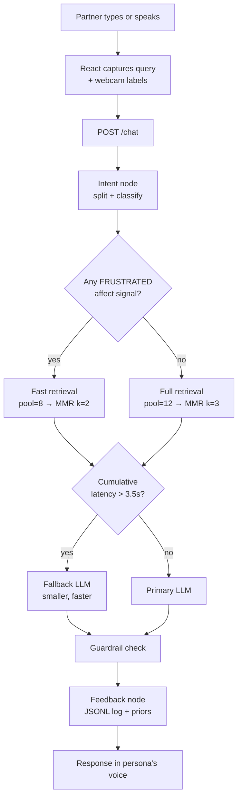
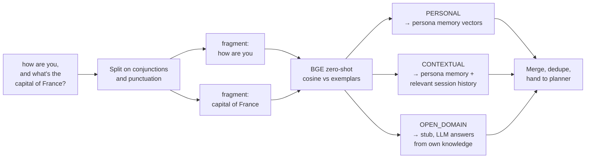
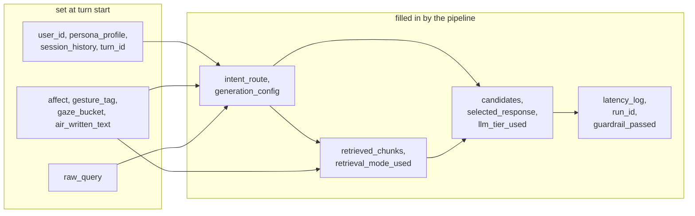

# Multimodal AAC Chatbot

A chatbot that **speaks as an AAC user, not to them.** You pick a persona (Mia, Gerald, or Arjun) and the partner talks to them — the bot replies in that person's voice, using their memories, and adjusts what it says based on what the webcam sees: facial expression, hand gestures, where they're looking, and letters they trace in the air.

It's a training-free agentic RAG pipeline — a plain Python function chain with two branching points, torch matmul for retrieval, JSONL for logging. The goal was to keep every piece simple enough to read top-to-bottom in an afternoon.

---

## Table of Contents

- [What is AAC?](#what-is-aac)
- [System Architecture](#system-architecture)
- [Prerequisites](#prerequisites)
- [Setup](#setup)
- [Configuration](#configuration)
- [Running the Project](#running-the-project)
- [Project Structure](#project-structure)
- [Personas](#personas)
- [Team](#team)

---

## What is AAC?

AAC (Augmentative and Alternative Communication) covers the tools people use when spoken or written communication is hard for them — cerebral palsy, ALS, autism, stroke recovery, and so on. Usually that's a tablet with a symbol grid, or an eye-tracker, or a switch. The slow part isn't the typing — it's that most devices don't know *you*. Every conversation starts from scratch.

This project is a small attempt at the other direction: give each user a persona their device already knows, and let the device reply in their voice.

---

## System Architecture

The browser does all the camera work. MediaPipe JS runs inside React, classifies what it sees into small labels (`affect`, `gesture_tag`, `gaze_bucket`, `air_written_text`), and sends those alongside the partner's text to `/chat`. The backend never touches pixels.

```
React (browser)                            Backend (Python)
  MediaPipe JS  ──┐
  Chat UI ────────┼── POST /chat ──► FastAPI ──► run_pipeline()
  Webcam ─────────┘                                │
                                       Intent ──► Retrieval ──► Planner ──► Feedback
```

Five layers, each a tiny file:

| Layer | Module | What it does |
|-------|--------|-------------|
| L1 | `frontend/src/hooks/useSensing.ts` | Watches the webcam. Turns faces/hands/gaze/air-writing into string labels. Purely frontend. |
| L2 | `backend/pipeline/nodes/intent.py` | Splits the partner's question on conjunctions and punctuation, then classifies each fragment as PERSONAL, CONTEXTUAL, or OPEN_DOMAIN using cosine similarity against a handful of seed sentences. No LLM call. ~30ms per turn. |
| L3 | `backend/pipeline/nodes/retrieval.py` | Each sub-intent goes to its own pool. Personal → the user's memory vector store. Contextual → persona memory + relevant in-session turns layered on top (so "what did I just ask" still sounds like *them*). Open-domain → a stub chunk telling the LLM to answer from its own knowledge (web search is deliberately out of scope). Wide cosine pool → MMR rerank against a query-fused-with-recent-history vector → top 3. |
| L4 | `backend/pipeline/nodes/planner.py` | Builds the prompt, calls the LLM, picks a response. Tone and max_tokens are shaped by the detected affect. |
| L5 | `backend/pipeline/nodes/feedback.py` | Writes one JSONL row per turn and bumps the Bayesian priors over which memory bucket was useful. |

Two places the pipeline branches:
- **Frustrated affect** → use the fast retrieval path (smaller cosine pool of 8, MMR-rerank to k=2). The user wants an answer, not a thesis.
- **Cumulative latency past 3.5s** → switch to the smaller fallback model for generation.

### End-to-end: from partner speaking to response rendered

One diagram, left to right, every step a turn goes through. Follow the arrows.

```mermaid
flowchart LR
    subgraph S1["① Partner side (browser)"]
        direction TB
        IN1[Partner types or speaks a question]
        IN2[Webcam frame]
        IN1 --> UI[Chat UI]
        IN2 --> MP[MediaPipe JS<br/>face + hands + gaze]
        MP --> LAB[Classify into labels<br/>affect, gesture_tag,<br/>gaze_bucket, air_written_text]
        UI --> REQ
        LAB --> REQ[POST /chat<br/>query + labels]
    end

    REQ ==> S2

    subgraph S2["② Backend pipeline (Python)"]
        direction TB
        HYD[Hydrate PipelineState<br/>session_history, priors, profile] --> INT
        INT[Intent node<br/>split query + classify fragments] --> BR1{FRUSTRATED?}
        BR1 -- yes --> RFAST[Fast retrieval<br/>pool=8 → MMR k=2]
        BR1 -- no --> RFULL[Full retrieval<br/>pool=12 → MMR k=3]
        RFAST --> POOL
        RFULL --> POOL[Dispatch per sub-intent]
        POOL --> PP[PERSONAL<br/>BGE vector store]
        POOL --> PC[CONTEXTUAL<br/>personal + BGE over history]
        POOL --> PO[OPEN_DOMAIN<br/>stub chunk]
        PP --> MERGE[Merge + dedupe]
        PC --> MERGE
        PO --> MERGE
        MERGE --> RR[MMR rerank<br/>query fused with<br/>last-N user turns]
        RR --> PLAN[Planner<br/>build prompt with<br/>retrieval blocks + tone tag]
        PLAN --> BR2{Total latency<br/>&gt; 3.5s?}
        BR2 -- yes --> LLMF[Fallback LLM<br/>Ollama Cloud, smaller]
        BR2 -- no --> LLMP[Primary LLM<br/>Ollama Cloud]
        LLMF --> GRD[Guardrail check<br/>persona breaks,<br/>unsupported claims]
        LLMP --> GRD
        GRD --> FB[Feedback node<br/>log turn to JSONL,<br/>bump bucket priors,<br/>append to session history]
    end

    FB ==> S3

    subgraph S3["③ Back to partner"]
        direction TB
        RESP[Response in persona's voice<br/>+ latency breakdown<br/>+ eval scores]
        RESP --> RENDER[Chat UI renders it]
    end
```



**A concrete example.** Partner says *"how are you, and what's the capital of France?"* while the webcam reads a relaxed face:

1. Browser sends `{query, affect: NEUTRAL, gesture_tag: null, …}`.
2. Intent node splits on `,` and ` and ` → two fragments. Classifier tags them `PERSONAL` and `OPEN_DOMAIN`.
3. Affect isn't FRUSTRATED, so full retrieval runs.
4. Dispatcher hits the persona store for fragment one, emits the open-domain stub for fragment two, merges both.
5. Planner drops the two chunks into separate prompt blocks and calls the primary LLM.
6. Guardrail passes, feedback writes the row, the response — in Mia's voice — comes back through the same `/chat` response.

Total wall time is normally under 6 seconds end-to-end; the slow part is the LLM call, not anything you wrote.

### What a single turn actually looks like



### How sub-intents fan out

This is the part that took a few iterations to get right. Each partner query can be *multiple* questions stitched together with "and" / "but" / punctuation. Each fragment gets classified separately and sent to its own retrieval pool.



The classifier is just cosine similarity against 5 seed sentences per class — no LLM, ~30ms per turn. The old version called an LLM and retried up to 3× on JSON errors; on a bad day that was 100+ seconds of dead time.

### State that flows between nodes

Every node takes a `PipelineState` dict and returns a partial update. Nothing is global.



---

## Prerequisites

- Python 3.10+ (we use conda; 3.12 is what the env ships with)
- Node.js 22+ and pnpm
- An [Ollama Cloud](https://ollama.com) account. Generation hits cloud models — you don't need a local Ollama daemon running.
- A webcam if you want to play with the full stack. The CLI works without one.

---

## Setup

```bash
git clone https://github.com/akashkolte/multimodal_aac_chatbot.git
cd multimodal_aac_chatbot
bash setup.sh
```

`setup.sh` takes care of everything on the first run: creates the `aac-chatbot` conda env, installs Python and frontend deps, copies `.env.example` → `.env` for you to fill in, and builds the per-persona vector indexes under `data/vector_store/`. The first build downloads the BGE-small embedder (~130MB), so expect a short wait.

If you edit a persona later, rebuild the indexes: `python -m backend.retrieval.vector_store`.

---

## Configuration

Everything is a Pydantic setting in [backend/config/settings.py](backend/config/settings.py) with a `.env` override. The knobs you'll actually touch:

| Variable | Default | What it does |
|----------|---------|-------------|
| `ACTIVE_LLM_TIER` | `primary` | Which tier to start on — `primary` or `fallback`. The pipeline switches automatically if a turn is slow. |
| `PRIMARY_MODEL` | `gemma4:31b-cloud` | Ollama Cloud model for the primary tier. |
| `FALLBACK_MODEL` | `gemma4:31b-cloud` | Smaller/faster model for the fallback tier. Point this at whatever smaller cloud model you have access to. |
| `PRIMARY_BASE_URL` | `http://localhost:11434/v1` | OpenAI-compatible endpoint. Defaults to the local Ollama proxy. |
| `FALLBACK_LATENCY_THRESHOLD` | `3.5` | If intent+retrieval already took this many seconds, skip the primary tier. |
| `RERANK_ENABLED` | `true` | Kill-switch for the MMR reranker. When off, retrieval truncates the cosine top-k directly. |
| `RERANK_LAMBDA` | `0.7` | MMR balance: `1.0` = pure cosine relevance, lower = more diversity. Drop to `0.5` if results look repetitive. |
| `RERANK_QUERY_WEIGHT` | `0.7` | Weight on the current turn vs the mean of recent user turns when building the rerank query. Lower if follow-ups under-weight prior context. |
| `LOGS_DIR` | `logs` | Where the per-turn JSONL goes. |

---

## Running the Project

### Full stack

```bash
bash run.sh
```

Starts FastAPI on `:8000` and the React dev server on `:7550`. Open [http://localhost:7550](http://localhost:7550). This is the mode you want for the webcam + sensing demo.

Pass any `backend.main` flag to `run.sh` and it drops the full stack and runs the CLI with those flags instead — handy for fast iteration:

```bash
bash run.sh --debug                    # CLI with per-turn state dumps
bash run.sh --user mia_chen --debug    # jump straight to Mia
```

### CLI directly

```bash
conda activate aac-chatbot
python -m backend.main --debug
```

The CLI prints the full `PipelineState` after each turn — useful when you want to see what the classifier did or which chunks came back from which pool.

### API directly

```bash
conda activate aac-chatbot
uvicorn backend.api.main:app --reload
```

```bash
curl -X POST http://localhost:8000/chat \
  -H "Content-Type: application/json" \
  -d '{"user_id": "stephen_hawking", "query": "What do you like to do on weekends?"}'
```

---

## Project Structure

```
multimodal_aac_chatbot/
├── frontend/                      React + Vite + TypeScript
│   └── src/
│       ├── components/            Chat UI, webcam, sensing status
│       ├── hooks/                 useWebcam, useSensing (MediaPipe JS)
│       └── lib/                   API client, sensing classification, DTW
│
├── backend/                       Python (conda env: aac-chatbot)
│   ├── main.py                    CLI entry point
│   ├── api/main.py                FastAPI REST API
│   ├── config/settings.py         Pydantic BaseSettings
│   ├── pipeline/
│   │   ├── graph.py               run_pipeline() — plain function chain
│   │   ├── state.py               PipelineState TypedDict
│   │   └── nodes/                 intent, retrieval, planner, feedback
│   ├── sensing/labels.py          GESTURE_DIRECTIVES (sensing runs in browser)
│   ├── retrieval/                 BGE embeddings (torch tensor) + bucket priors
│   ├── generation/llm_client.py   2-tier Ollama Cloud LLM client (primary/fallback)
│   └── guardrails/checks.py      Input + output safety checks
│
├── data/
│   ├── users.json                 Persona index
│   ├── memories/                  Per-persona memory JSONs
│   └── vector_store/              vectors.pt + meta.json (gitignored, rebuilt)
├── logs/                          Per-turn JSONL logs (gitignored)
│
├── setup.sh                       One-time setup script
├── run.sh                         Start backend + frontend
├── requirements.txt               Python dependencies
└── .env.example                   Environment variable template
```

---

## Personas

Fourteen personas — nine anchored in real memoirs, five in canonical fiction. Together they span ALS, Parkinson's, locked-in syndrome, aphasia, Alzheimer's, cerebral palsy, non-verbal and savant autism, intellectual disability, and spinal cord injury. The point isn't to represent any one person — it's to give the model a wide enough range of voices that "sound like Mia" is a harder target than "sound helpful."

| ID | Source | Condition |
|----|--------|-----------|
| `stephen_hawking` | Real — *My Brief History* + interviews | ALS (mid-stage) |
| `michael_j_fox` | Real — four memoirs | Young-onset Parkinson's |
| `wendy_mitchell` | Real — *Somebody I Used to Know* + blog | Early-onset Alzheimer's |
| `christopher_reeve` | Real — *Still Me* | C4 spinal cord injury |
| `christy_brown` | Real — *My Left Foot* | Cerebral palsy (adult) |
| `gabby_giffords` | Real — *Gabby* memoir | Aphasia + TBI |
| `jason_becker` | Real — *Not Dead Yet* doc | Late-stage ALS |
| `jean_dominique_bauby` | Real — *The Diving Bell and the Butterfly* | Locked-in syndrome |
| `tito_mukhopadhyay` | Real — three+ books | Non-verbal autism |
| `abed_nadir` | Fictional — *Community* | Autism (verbal) |
| `allie_calhoun` | Fictional — *The Notebook* | Late-stage Alzheimer's |
| `forrest_gump` | Fictional — *Forrest Gump* | Intellectual disability |
| `walter_jr_white` | Fictional — *Breaking Bad* | Cerebral palsy (teen) |
| `raymond_babbitt` | Fictional — *Rain Man* | Savant autism |

Each persona has ~120–210 memory chunks (canon-driven, no filler) across five buckets — `family`, `medical`, `hobbies`, `daily_routine`, `social` — and three chunk types: `narrative`, `social_post`, `chat_log`. Somewhere around 2,300 chunks total across the set.

Data provenance is documented. See [references.md](references.md) for the bibliography — memoirs, films, interviews — and the ethics notes on living-persons treatment.

Adding a new persona: drop a JSON file into `data/memories/` following the schema of any existing one, then run `python data/generate_users.py` and `python -m backend.retrieval.vector_store`.

---

## TODO

From the spec (pages 10–11). Tags: **[Core]** = must do, **[Bonus]** = nice to have, **[Eval]** = for the grade.

Heads up: all camera/sensing stuff is in the frontend (MediaPipe JS). Backend just gets the labels (`affect`, `gesture_tag`, `gaze_bucket`). Only `backend/sensing/labels.py` (`GESTURE_DIRECTIVES`) lives on the backend.

### Dataset

- [ ] **[Core]** Memories are only autobiographical narratives right now. Need more variety:
  - [ ] social media posts (voice-matched, synth with LLM)
  - [ ] past chat logs (synth with LLM)
  - [ ] update the generator script + rebuild vector store
  - [ ] tag chunks by type so retriever knows what it pulled
- [ ] **[Core]** Write down the data schema somewhere so evals can reuse it

### Sensing (frontend)

- [x] **[Core]** Head-nod / sharp tilt / head-shake = "I don't like that". Different from frustrated affect.
  - [x] frontend `HeadPoseTracker` (deadband-filtered shake + sharp-nod-with-recovery), explicit calibrate button, live Δx/Δy debug readout in sidebar
  - [x] dedicated `POST /chat/turnaround` endpoint reuses cached last-state — one extra LLM call, no full pipeline re-run
  - [x] intent-aware turnaround: PERSONAL re-retrieves excluding the rejected bucket *and* exact rejected chunk texts (with `turnaround_min_score` floor — falls back to original chunks rather than degrading); PRESENT_STATE flips emotional read or admits uncertainty
  - [x] UI: rejected bubble gets strikethrough + "rephrased" badge, new bubble appended with "↻ turnaround" badge — both visible (you can't unsay something to a partner). Manual "↻ Not quite right" button as fallback
  - [x] guards: `turnaroundConsumedTurnRef` prevents self-retrigger loops; backend `turn_id` returned in `ChatResponse` so frontend doesn't desync on persona switch; stale-turn 409
- [x] **[Core]** Smile / positive affect actually changes wording now. Affect compiles into a `StyleDirective` (register + prefer/avoid words + exemplar + opener hint) rendered as explicit instructions in the turn-specific user message — see `_AFFECT_CONFIG` in [backend/pipeline/nodes/intent.py](backend/pipeline/nodes/intent.py) and `_build_user` in [backend/pipeline/nodes/planner.py](backend/pipeline/nodes/planner.py). The persona's own `stylistic_preferences` (from the memory JSONs) carry the stable baseline in the cached system message; the affect directive is how that baseline shifts per turn. Measured by `compute_multimodal_alignment` (positive/negative lexicon).
  - Fixed a long-standing bug where LCP (lip-corner pull) was accidentally the *x-coordinate* of the mouth centre, so it drifted on head turns and almost never fired FRUSTRATED. Now measured as vertical pull of the corners relative to mouth centre, normalised by inter-ocular distance. HAPPY/FRUSTRATED thresholds retuned to the new scale; FRUSTRATED also triggers on brows-lowered + squinting as a second path. See `computeAffectVector` and `classifyAffect` in [frontend/src/lib/sensing.ts](frontend/src/lib/sensing.ts).
  - Calibration is now averaged over the first 30 frames (~1s of neutral face) instead of a single-frame snapshot — a brief smile at startup used to lock in a biased baseline. Affect stays null during calibration; gaze/head/gesture/air-writing still flow.
- [x] **[Core]** Gestures (`THUMBS_UP` / `THUMBS_DOWN` / `POINTING` / `WAVING`) now carry an `opener_hint` via `GESTURE_DIRECTIVES` in [backend/sensing/labels.py](backend/sensing/labels.py). A detected thumbs-up overrides the affect opener and tells the LLM to lead with an affirmation.
- [x] **[Core]** Air-writing carries a default template bank ([frontend/src/lib/airTemplates.ts](frontend/src/lib/airTemplates.ts): `yes` / `?` / `hi` / `help` / `done` / `more` / `water` / `stop`) — all single-stroke shapes so DTW can match reliably. On match, the word flows through the pipeline three ways: (1) retrieval picks up the word as an extra `PERSONAL` sub-intent with a bucket hint (see `infer_bucket` in [backend/sensing/bucket_keywords.py](backend/sensing/bucket_keywords.py) — e.g. `help` → medical, `water` → daily_routine), (2) the planner includes an explicit "the user air-wrote X — incorporate verbatim if appropriate" instruction in the user message, and (3) the word appears in `logs/turns.jsonl` for debugging. The recognizer has a `MATCH_THRESHOLD` reject gate and `console.debug`s on empty-bank / no-match so unrecognised strokes never reach the backend. To add more templates, append entries to `DEFAULT_AIR_TEMPLATES` as 32-point normalised single-stroke trajectories.
- [ ] **[Bonus]** Voice + air-writing conflict resolution. Capture short voice (Web Speech API), compare to air-written intent, send a `resolved_intent`
- [ ] Thumbs-up currently biases the opener via the prompt. Once generation emits N candidates, move this to candidate reranking for a stronger signal.

### Intent decomposition

> Current state: regex-splits the partner query on conjunctions/punctuation into fragments, then runs each fragment through a BGE zero-shot classifier (cosine vs. seed exemplars per class). No LLM call, no retries. Runs in ~10–30ms per turn. Bucket hints for `PERSONAL` fragments come from a shared keyword helper in [backend/sensing/bucket_keywords.py](backend/sensing/bucket_keywords.py). Earlier versions used an LLM with Pydantic validation + 3 retries, which cost ~100s per turn on Ollama Cloud when the model emitted bad JSON.

- [x] **[Core]** Personal / Contextual / Open-domain dispatch to distinct pools (personal → BGE vector store; contextual → persona memory + relevant in-session turns layered on top; open-domain → stub chunk, LLM answers from its own general knowledge — web search is intentionally out of scope).
- [x] intent node latency — split + BGE zero-shot classifier replaces the LLM router. Parallelising sub-query retrieval is still open.
- [x] **[Core]** `PRESENT_STATE` intent class — questions about right-now state ("how are you feeling?", "are you tired?") used to fabricate confident answers from autobiographical memory (wrong by category, not just by wording). Now they skip retrieval entirely and the planner uses an affect-grounded prompt branch with explicit fallback to "I'm not sure" when the read is ambiguous. Margin guard demotes narrow PRESENT_STATE wins to PERSONAL (better to over-retrieve than to silently drop persona memories). Air-written supplements are classified the same way as a normal fragment — a present-tense supplement on a PRESENT_STATE query no longer flips the route to PERSONAL.

### Retrieval

> Current state: BGE-small cosine search over per-user torch tensors. Each personal sub-intent fetches a wider pool (12 candidates, 8 on the FRUSTRATED fast path), then MMR reranks against a query vector that's fused with the last 2 user turns — see `build_context_vector` and `mmr_rerank` in [backend/retrieval/reranker.py](backend/retrieval/reranker.py). MMR runs across the merged personal + contextual pool so history-derived chunks compete with persona memories. Knobs in [backend/config/settings.py](backend/config/settings.py): `rerank_lambda` (relevance vs diversity, default 0.7), `rerank_query_weight` (current turn vs history, default 0.7), `rerank_enabled` as kill-switch. Steady-state `t_rerank` is ~15ms with no history, ~50ms when history is fused.

- [x] **[Core]** Reranking — MMR with conversation-context query fusion. Wider cosine pool, then diversity-aware reorder against `0.7·current_query + 0.3·mean(last-2-user-turns)`. Both fast and full paths rerank; OPEN_DOMAIN stub is pinned outside the rerank.
- [ ] **[Bonus]** Bucket priors only live for the session. Persist them per user
- [ ] **[Bonus]** Latency fallback only switches LLM tier. Add more steps:
  - flip `rerank_enabled=False` if retrieval+rerank is slow (cheap kill-switch already in place)
  - return a canned response if we blow the budget entirely
  - threshold is 3.5s, spec says 6s — pick one
- [ ] **[Bonus]** Cache encoded user-turn embeddings across the session — `build_context_vector` re-encodes the same recent turns every turn (~50ms steady-state cost)
- [ ] **[Scale]** past ~100k chunks per user, swap torch matmul for `hnswlib`; consider a cross-encoder reranker (e.g. `bge-reranker-base`) if `rerank_pool_k` grows past ~30

### Generation

- [ ] **[Core]** API returns one response. Should return multiple candidates so the user can pick (and so the next item works)
- [ ] **[Core]** Frontend needs a candidate picker — show all the options, let the user click one, send the selection back
- [ ] **[Bonus]** When user picks a candidate, save the `(query, picked)` pair to a side vector index and check it first next turn
- [x] LLM temperature bumped from 0.4 → 0.8 in [backend/pipeline/nodes/planner.py](backend/pipeline/nodes/planner.py). The old setting produced near-identical responses across turns even when affect/gesture changed, which made the sensing→output link hard to see. 0.8 gives meaningful lexical variation while staying in the persona's voice.

### Evals

Live per-turn scores show up in the `EvalPanel`. State:

| Metric | Status |
|--------|--------|
| Efficiency | works (SLO check on `t_total`) |
| Faithfulness | stub, returns 0 |
| Multimodal alignment | works — affect (sentiment lexicon), gesture (opener regex), gaze (bucket match) |
| Authenticity | star rating in UI but not saved |

- [ ] **[Eval]** Faithfulness — actually check if the response is grounded in what we retrieved. NLI model, sentence-level. If we didn't retrieve anything, flag `no_evidence` instead of pretending we scored it
- [ ] **[Eval]** Efficiency — per-turn SLO check is done, but for the writeup we need aggregate latency: p50/p95 across a fixed query set, broken out by LLM tier. Spec target is < 6s
- [x] **[Eval]** Multimodal alignment — implemented in `backend/evals/multimodal_alignment.py`. Affect scored by positive/negative lexicon overlap vs. target sentiment, gesture by opener-phrase regex (THUMBS_UP/THUMBS_DOWN/WAVING), gaze by fraction of retrieved chunks matching the looked-at bucket. Returned on every turn as `multimodal_alignment` / `affect_alignment` / `gesture_alignment` / `gaze_alignment`
- [ ] **[Eval]** Authenticity — the Likert stars are wired up in the UI but go nowhere. Save them, log them with the turn so we can actually look at them later
- [ ] **[Eval]** For the live in-class eval: figure out the actual session — who rates (partners + experts per spec), how many turns each, what gets shown to them. The Likert form is the easy part; the protocol isn't written down anywhere
- [ ] **[Eval]** Need an offline version of all three model-driven evals (faithfulness / alignment / efficiency). Aggregate numbers across a fixed query set per persona for the writeup

### Cleanup

- [ ] move the affect → `StyleDirective` config (`_AFFECT_CONFIG` in [intent.py](backend/pipeline/nodes/intent.py)) and the gesture directives ([labels.py](backend/sensing/labels.py)) out of code into a yaml
- [x] delete `backend/sensing/` (dead code, sensing is in frontend) — done, only `labels.py` remains
- [x] per-persona affect overrides (`_PERSONA_TONE_OVERRIDES`) deleted — redundant with `stylistic_preferences` in the new persona JSONs

---

## Team

- **Akash Kolte** — akashjag@buffalo.edu
- **Shwetangi** — shwetang@buffalo.edu

University at Buffalo, SUNY

---

## License

All rights reserved. See the [LICENSE](LICENSE) file for details.
